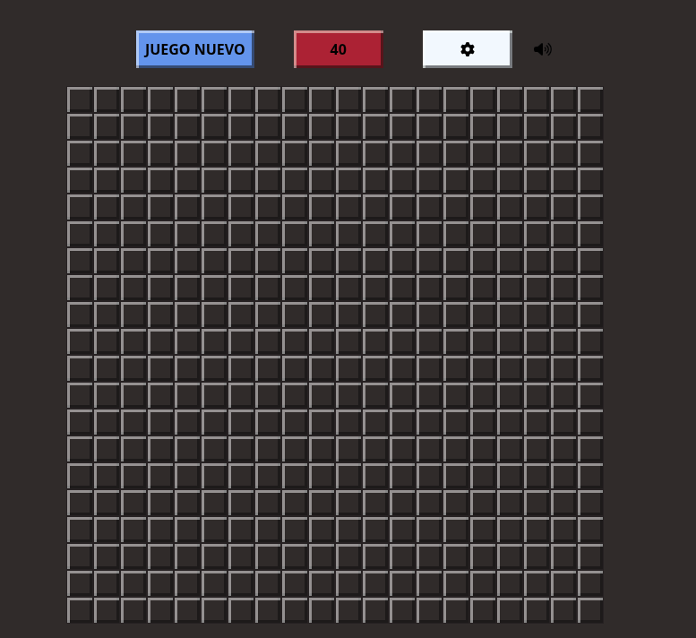
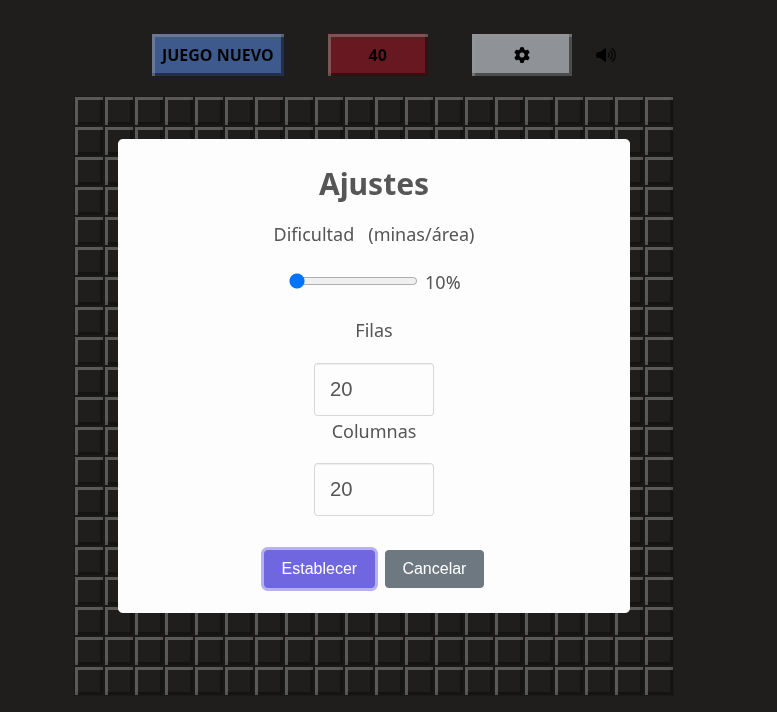
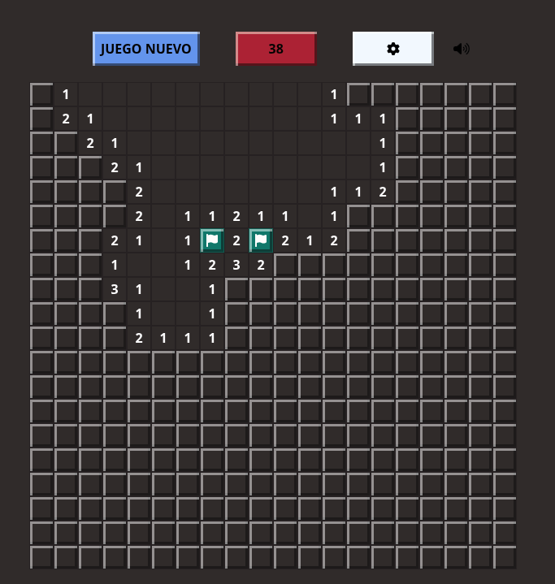
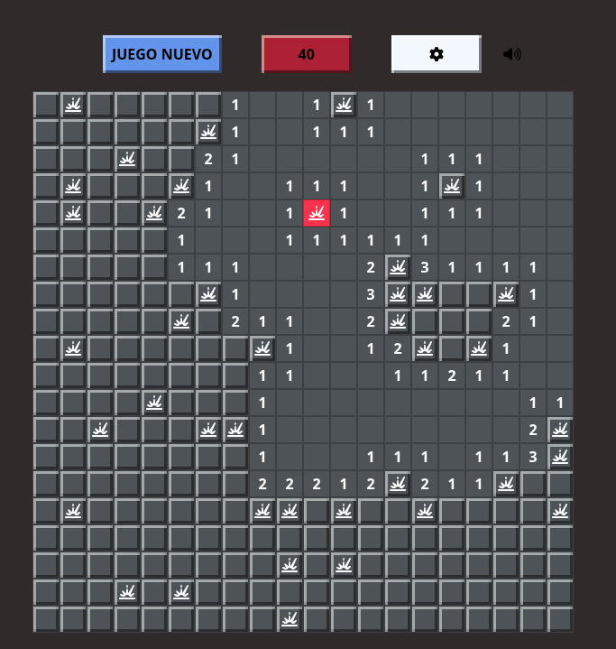

# 💣 Buscaminas Clásico

> Una recreación moderna del clásico juego de estrategia, desarrollada con JavaScript Vanilla, lógica algorítmica recursiva y gestión de eventos.


## 📸 Galería de Capturas

| Vista Principal | Menú de Ajustes |
|:---:|:---:|
|  |  |
| **Jugabilidad** | **Fin del Juego** |
|  |  |

---

## 📽️ Demostración de Gameplay

¡Mira el juego en acción! En este video se muestra la generación del tablero, la expansión recursiva y la interfaz de usuario.

[Gameplay Buscaminas](https://youtu.be/l22zaAyvzQ8)

---

## 📖 Descripción Técnica

Este proyecto es una implementación completa del juego Buscaminas diseñada para fortalecer el pensamiento lógico-matemático aplicado a la programación. El núcleo del desarrollo se centró en la manipulación eficiente del **DOM**, la gestión asíncrona de eventos y, crucialmente, el uso de **algoritmos recursivos** (Flood Fill) para la mecánica de despeje de áreas.

El juego no solo replica la mecánica clásica, sino que mejora la experiencia de usuario (UX) con retroalimentación auditiva, controles de dificultad dinámicos y una interfaz moderna.

## 🚀 Características Principales

* **⚡ Algoritmo de Expansión Recursiva:** Implementación optimizada de *Flood Fill* que evalúa celdas adyacentes en cascada al detectar un espacio vacío (0).
* **🎛️ Generación Dinámica:** El tablero se renderiza 100% mediante JavaScript, permitiendo modificar las dimensiones (`N x M`) en tiempo real sin recargar la página.
* **🔊 Sistema de Audio Inmersivo:** Efectos de sonido para interacciones clave (victoria, explosión, banderas) con un interruptor global de silencio (`Mute/Unmute`).
* **⚙️ Configuración Avanzada:** Integración de **SweetAlert2** para un panel de control modal que permite personalizar:
    * Dimensiones del tablero (Filas/Columnas).
    * Densidad de minas (Dificultad porcentual).
* **🎮 Mecánicas Completas:**
    * *Clic Izquierdo:* Descubrir celda.
    * *Clic Derecho:* Marcar/Desmarcar bandera.
    * *Doble Clic:* Despeje rápido de áreas seguras.

## 🛠️ Stack Tecnológico

* **Core:** HTML5 Semántico, CSS3 (Flexbox/Grid), JavaScript (ES6+).
* **Librerías:** [SweetAlert2](https://sweetalert2.github.io/) (Modales interactivos).
* **Assets:** [FontAwesome](https://fontawesome.com/) (Iconografía).
* **Control de Versiones:** Git & GitHub.

## 🧠 Reto Técnico: La Recursividad

El mayor desafío fue la implementación de la función `abrirArea(c,f)`. Se utilizó recursividad para verificar las celdas adyacentes automáticamente. 

Para evitar errores comunes como el *Stack Overflow* (desbordamiento de pila) o bucles infinitos, se implementó un sistema de "banderas de estado" y bloques `try-catch` para manejar los límites de la matriz (bordes del tablero).

```javascript
/**
 * Fragmento de la lógica de recursividad (Flood Fill).
 * Verifica las 8 celdas circundantes a la coordenada actual.
 */
function abrirArea(c, f) {
    for (let i = -1; i <= 1; i++) {
        for (let j = -1; j <= 1; j++) {
            try {
                // Solo procesamos si no está descubierto ni marcado
                if (tablero[c + i][f + j].estado != "descubierto" && tablero[c + i][f + j].estado != "marcado") {
                    tablero[c + i][f + j].estado = "descubierto";
                    // Si la celda adyacente también es 0, llamamos recursivamente
                    if (tablero[c + i][f + j].valor == 0) {
                        abrirArea(c + i, f + j);
                    }
                }
            } catch (e) {
                // El catch ignora los intentos de leer fuera de los límites del array
            }
        }
